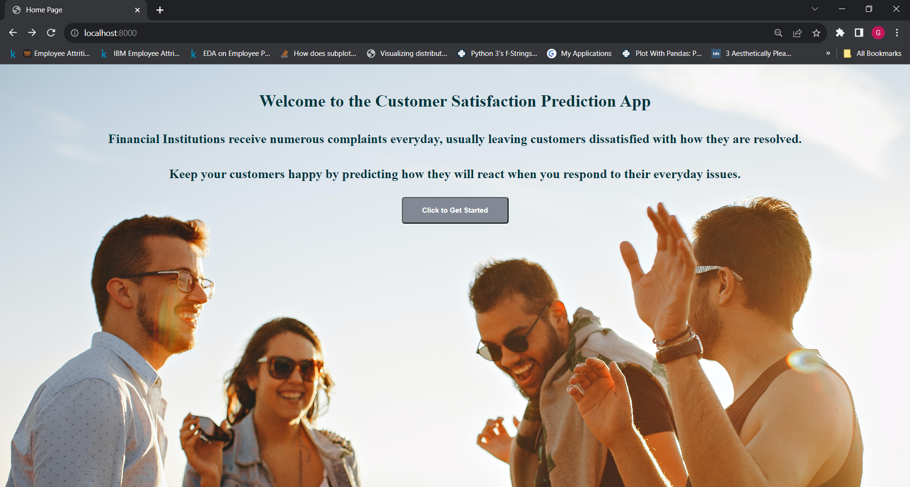
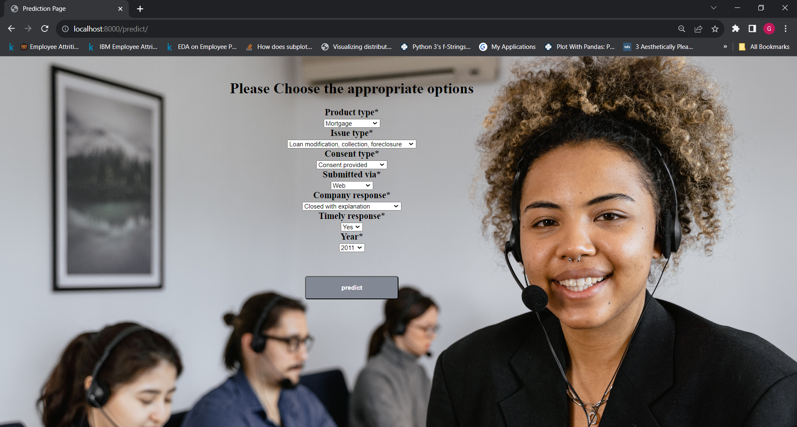
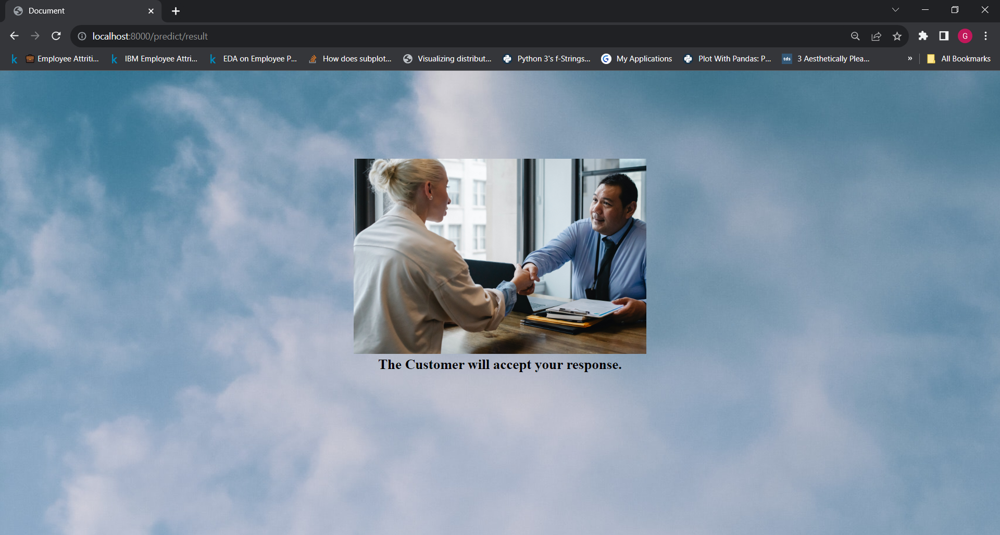
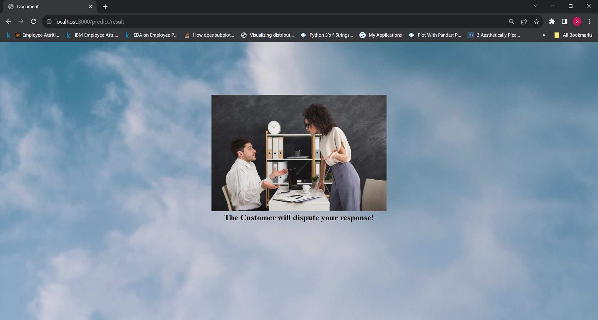

This is an end to end machine learning project. The aim of this project is to develop a machine learning model and deploy as a web service.

Functional requirements:
- User should should be able to login with their credentials
- User should be able to make prediction

Non functional requirements:
- The system should be highly available
- The system should perform at an excellent level
- The system should be compatible with any operation system e.g Mac OS, Windows, iOS, Android


2. Build a model that will provide a solution
3. Wrap and host in a simple web service (Flask)
4. Build a small app (UI - CSS and HTML) that uses it 
5. Set up a CI/CD retraining pipeline
6. set up a monitoring device (Aporia, WhyLabs)


Requirements 
1. Flask / Django
2. Machine learning knwoledge 
3. Software development 
4. Devops

<br><br>

## <b>Access the web app</b>
-  To use the web service, [click this link](http://3.138.119.19:8080)


<br>
<br>

# <b> Steps to run this project locally</b>
<br>

### Please note that it is advisable to carry out these steps in a virtual environment.

<br>
On your terminal: <br><br>
- Initialize a git repository in your preferred directory using: <br>

 ```bash
  git init
```

- Clone the repository to your local repository using:  <br>
  ```bash
  git clone https://github.com/Tobi-Ade/Machine-Learning-Deployment.git
  ```
  Now you should see all the project files in your directory 
  <br>
  <br>

## <b> Runnning the Flask App</b>
<br>
- Navigate into the flask app directory by running:

```bash
  cd ".\flask app"
```

- The **requirements.txt** file contains all the dependencies needed to run the project successfully. You can install these by running:
```bash
  pip install -r requirements.txt
```

- Now that all the dependencies are installed, you can simply start the api by running:
```bash
  python app.py
```
The flask api should start running at this stage. You can send a request and get instant results, or copy the url where the api is running and paste it in your browser, where you can interact with the api.  
<br>

- The **request.py** file contains a sample request. To use this, keep the api running and open an new terminal window, navigate to the current directory, then run:
 ```bash
  python request.py
```
The request.py file can also be modified to see how the result changes. You can also create a custom request using the same format in the request.py.

<br>
<br>

## <b> Runnning the Django App</b>
<br>
- Navigate into the django app directory by running:

```bash
  cd ".\Django app"
```

- The **requirements.txt** file contains all the dependencies needed to run the project successfully. You can install these by running:
```bash
  pip install -r requirements.txt
```

- Navigate into the project directory by running 
```bash
  cd deployment
```
- If you check all the files in this directory you can find the **manage.py** file  whihc is needed to run the app (mlApp). Now run:

```bash
  python manage.py runserver
```

- If you have a preferred address where you wish to run the server, you can do that by adding the address after "runserver". Example:<br>
```bash
  python manage.py runserver 127.0.0.1:8080
```
This means the server will run on "127.0.0.1:8080"

Now you can copy the url where the serve is running and paste it in your browser, where you can interact with the web app.

<br>
<br>

## <b> Webpage Images</b>
<br>

### Homepage 


## Selection Page 


## Acceptance Page 


## Rejection Page 



